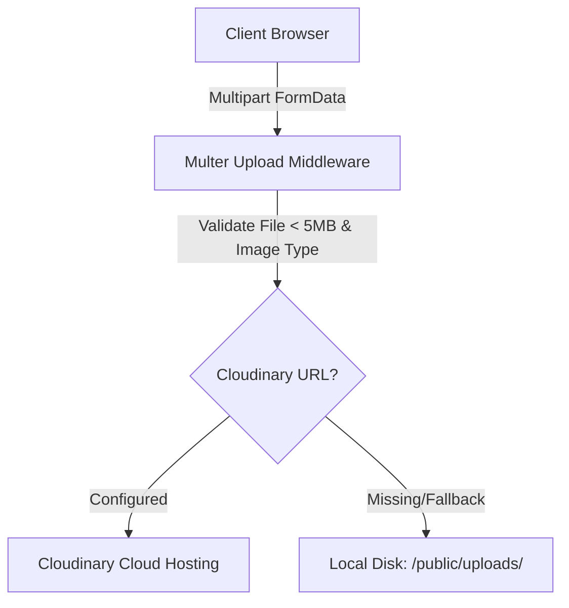

# System Design Specification

This document details the core architectural mechanisms, data flows, and security protocols of the **Society Maintenance Tracker** application.

---

## 1. Complaint History (Audit Trail Ledger)
To enforce transparency and data integrity, status changes and technician assignments are logged as immutable audit records in the `ComplaintHistory` table. 

### Database Schema Alignment
The history engine maps relationships as follows:
- **Complaint**: Connects to `ComplaintHistory[]` via a cascading relationship (`onDelete: Cascade`), ensuring that purging a ticket automatically cleanses its history without leaving orphaned nodes.
- **ComplaintHistory**: Stores `id`, `complaintId` (FK), `changedById` (FK to `User`), `fromStatus` (nullable), `toStatus` (nullable), `adminNote` (nullable), and `timestamp` (`default(now())`).

### Transactional Integrity
When a resident submits a complaint, the creation is executed in a single atomic database transaction, inserting:
1. The new `Complaint` row.
2. The initial `ComplaintHistory` transition (`fromStatus: null` $\to$ `toStatus: "OPEN"`).

Subsequent status or priority updates by administrators inject new history logs. Past history records are immutable and cannot be updated or deleted, providing a complete historical ledger of the ticket's lifecycle.

---

## 2. SLA Overdue Detection Engine
Rather than relying on static columns or database sync schedules, the overdue status is computed dynamically in-memory or on-the-fly to prevent database drift.

### Threshold Configuration
The resolution SLA threshold is stored in the database under the `SystemSetting` table with a unique PK `key = "overdue_threshold_days"` (defaulting to `"3"`). This enables live administrative overrides of society SLA rules without restarting the server or running migrations.

### Calculation Logic
A ticket is classified as overdue if it meets the following condition:
$$\text{status} \neq \text{"RESOLVED"} \land (\text{now} - \text{createdAt} \ge \text{thresholdDays} \times 24 \times 60 \times 60 \times 1000)$$

### Sorting Priority
To guarantee immediate attention to critical delays, lists are sorted with priority given to overdue tickets:
`ORDER BY isOverdue DESC, createdAt DESC`

---

## 3. Photo Handling & Storage Architecture
Residents can attach visual evidence of maintenance issues to complaints. The photo handling pipeline manages files as follows:

### Validation Guards
- **File Type**: The upload middleware restricts files to `.jpg`, `.jpeg`, `.png`, and `.webp`. Non-image attachments (e.g. `.exe`, `.pdf`) are rejected with `400 Bad Request`.
- **File Size**: Uploads are restricted to a maximum size of **5MB** to prevent server memory saturation.

### Dynamic Storage Fallback
If the `CLOUDINARY_URL` environment variable is defined, the system mounts a Cloudinary storage engine. Otherwise, it transparently falls back to local disk storage in `server/public/uploads/`. Local file paths are normalized to web URLs (e.g., `/uploads/filename.png`) so frontend image elements render correctly.

---

## 4. Notification & Broadcast Architecture
The system sends automated alerts for critical updates.

### Status Change Alerts
Whenever an admin alters a ticket status or priority, an asynchronous notification is dispatched to the submitting resident's email. The message includes the complaint title, the status change, and the admin note.

### Notice Board Broadcasts
- **Important Announcements**: When creating a notice with `isImportant = true`, the notice is styled with a distinct glowing border and pinned to the top of the board. The notice is also broadcasted to the registered emails of all residents.
- **Standard Announcements**: Notices with `isImportant = false` are chronologically appended to the feed without sending emails.

### Asynchronous Resilience
Email operations run in non-blocking try-catch blocks. If the SMTP server is down or credentials are empty, the backend logs the email details to the console simulator and allows the HTTP transaction to complete successfully, preventing mail delivery failures from rolling back status updates.
